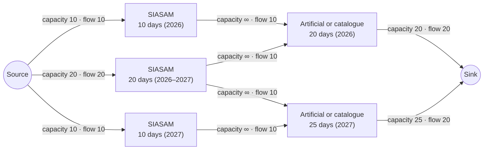

# SiasamWorkFlow User Guide

SiasamWorkFlow creates the maintenance requests used by the OptMain model to project the
unavailability of a power system due to maintenance over a study horizon. There are two main
factors in the unavailability due to maintenance: (i) the maintenance already requested by the
agents within the horizon; and (ii) a projection of the maintenance not yet requested within the
horizon.

## Theoretical analysis of the script

All the maintenance already requested is evaluated, in order to approve or reject it according to
the methodology. It is also necessary to project the unavailability, so that the analysis of the
reliability indices and operating costs of the system over the study horizon is close to reality. For this reason, three different types of maintenance
request are defined:

1. **SIASAM requests:** maintenance already requested by the agents, which will be evaluated by
   the methodology;
2. **Requests defined by a maintenance catalogue:** the minimum set of maintenance each plant must
   perform to keep the reliability level foreseen by the manufacturer of its generating units;
3. **Artificial requests:** due to their operating life, some plants do not follow the minimum
   maintenance required by the catalogue and, therefore, make requests in the SIASAM system that
   do not follow it. A minimum maintenance assumption is defined for these plants.

Catalogue and artificial requests are used as a minimum expectation of the maintenance that must
be performed within the study horizon, representing requests not yet made by the respective
agents. Thus, if a plant already has an associated SIASAM request, the unavailability it causes
must be discounted from the expected unavailability linked to the catalogue or artificial
requests. In practice, this means removing or reducing the duration of those maintenances, while
keeping the SIASAM ones.

However, associating the SIASAM requests with the catalogue or artificial ones is not always
straightforward, since SIASAM requests do not follow a standard. A methodology was used that
represents all the requests of each unit as a radial (unidirectional) graph model, solved with the
Ford-Fulkerson and *Network Simplex* methods. For each unit, the methodology represents each
request as a vertex, and the edges represent "maintenance flows". That is, a flow between a SIASAM
request vertex and an artificial request vertex indicates, in practice, that the maintenance of
the first replaces that of the second, avoiding duplicating the amount of maintenance performed
within the horizon. It is important to note that all SIASAM requests are always kept in this
process; the desired result is to know which artificial or catalogue requests can be replaced or
reduced.

The objective of the model is to maximise the flow originating from the SIASAM request vertices,
flowing from the source vertices to the sink vertices — that is, to replace as many artificial or
catalogue requests as possible with SIASAM ones. The constraints of the problem are the maximum
flow allowed on each edge, which corresponds to the maintenance duration of the adjacent request.
Since the flow starts from, and is limited by, the SIASAM request vertices, the maximum total flow
that can reach the sink corresponds to the total unavailability of the SIASAM requests. Thus, it
is possible to infer which artificial or catalogue requests will be removed or reduced, based on
which of their adjacent edges carry full or partial flow. This logic is illustrated in Figure 1.



Resulting requests: the SIASAM requests of 10 days (2026), 20 days (2026–2027) and 10 days (2027),
and a remainder of 5 days (2027) of the artificial or catalogue requests.

*Figure 1. Illustrative example of the methodology for assigning SIASAM requests to artificial or
catalogue requests.*

Therefore, the total unavailability of a generating unit due to the resulting requests will always
be, at least, the same as the total of the artificial or catalogue requests. Moreover, the
assignment is only possible if the horizons of the requests are compatible.

### GenerateCatalogueSiasam

The ***GenerateCatalogueSiasam*** routine aims to generate an estimate of future maintenance
requests for power plants. To do so, it relies on data on the technical requirements of each type
of technology and on the maintenance history of each plant. As a result, this module generates a
list of maintenance requests together with the precedence constraints that link them.

- **Input data:**
  - **`catalogo_general_completo.csv`**: maintenance requirements by technology or by plant.
    Columns:
    - "Tecnologia" (text): name of the technology, or name of the plant ("{three-letter code}-U{unit}").
    - "Codigo Tecnologia" (text): code of the technology, or name of the plant ("{three-letter code}-U{unit}").
    - "Intervalo" (integer): interval between maintenances, in days.
    - "Duracao" (integer): duration of the maintenance, in days.
  - **`historico.csv`**: historical maintenance data by plant. Columns:
    - "Nome SIASAM" (text): name of the plant ("{three-letter code}-U{unit}").
    - "Saida" (date): start date of the maintenance.
    - "Duracao" (integer): duration of the maintenance, in days.
  - **`plantas_para_catalogo.csv`**: list of plants to generate maintenance requests for (and their
    relevant information). Columns:
    - "Codigo" (integer): SDDP code of the plant.
    - "Nome" (text): SDDP name of the plant.
    - "Unidades" (integer): number of generating units of the plant.
    - "Tipo" (integer): SDDP code of the plant type (0=thermal, 1=hydro, 6=renewable).
  - **`tecnologias_plantas.csv`**: technologies of the plants according to the SIASAM naming
    convention.
    - "Nombre" (text): SDDP name of the plant.
    - "Tecnologia" (text): code of the technology of the plant.
  - **`optmuntcod.csv`**: plants with non-sequential unit names.
    - "!PlantName" (text): SDDP name of the plant.
    - "PlantType" (integer): SDDP code of the plant type (0=thermal, 1=hydro, 6=renewable).
    - "PlantSystem" (integer): SDDP code of the system of the plant.
    - "NumUnitCodes" (integer): number of generating units.
    - "UnitsCodes" and the following columns (integer): the remaining columns are filled with the
      codes of the units, sequentially.
- **Output data:**
  - **`faltando_catalogo.csv`**: list of plants with missing information in the catalogue, if any.
    It has a single column, with the names of the plants.
  - **`solicitudes_minimas.csv`**: minimum maintenance requirements according to the catalogue.
    Columns:
    - "Nombre referencia" (text): code of the request.
    - "Codigo de la planta en el SDDP" (integer).
    - "Tipo de la central" (integer): 0=thermal, 1=hydro, 6=renewable.
    - "Nombre de la planta en el SDDP" (text).
    - "Codigo de la unidad en el OptMain" (integer).
    - "Dia de la fecha minima" (integer).
    - "Mes de la fecha minima" (integer).
    - "Ano de la fecha minima" (integer).
    - "Dia de la fecha maxima" (integer).
    - "Mes de la fecha maxima" (integer).
    - "Ano de la fecha maxima" (integer).
    - "Duracion del mantenimiento" (integer): in days.
  - **`precedencia_solicitudes_minimas.csv`**: precedence constraints associated with the minimum
    maintenance requirements of the catalogue. Columns:
    - "!PrecName" (text): code of the constraint.
    - "SolName" (text): code of the request.
    - "DelayMin" (integer): minimum delay relative to the previous one, in days.
    - "DelayMax" (integer): maximum delay relative to the previous one, in days.

Note that the files `solicitudes_minimas.csv` and `precedencia_solicitudes_minimas.csv` are also
inputs to the *UpdateSiasam* routine.

### UpdateSiasam

The ***UpdateSiasam*** module aims to reconcile the minimum theoretical maintenance requirements
(generated by the *GenerateCatalogueSiasam* routine) with the most recent actual maintenance
requests made by the agents of the electric system and the asset owners (called "SIASAM
requests"). This repository implements a matching methodology based on a graph model, using the
Ford-Fulkerson and *Network Simplex* optimisation methods explained above. The result is a list of
maintenance requests that contains all the requests of the SIASAM system and complements them with
artificial requests or requests projected from a maintenance catalogue.

- **Input data:**
  - **`01-04Feb-CorrespondenciaCentrales_SDDP_SIASAM.csv`**: correspondence between the generators
    of the catalogue and the SIASAM data.
    - "Codigo" (integer): SDDP code of the plant.
    - "Nombre" (text): SDDP name of the plant.
    - "Unidad Fisica" (integer): sequential number of the generating unit.
    - "Tecnologia" (text): "Termica", "Hidro mayor" or "Hidro menor".
    - "SiasamName" (text): SIASAM name of the plant.
    - "SiasamName-ConGCR" (text): SIASAM name of the plant with the code of the regional office
      ("{code of the regional office}-{SIASAM name}").
  - **`solicitudes_siasam.csv`**: SIASAM maintenance requests.
    - "Equipo" (text): SIASAM name of the plant.
    - "Tipo Equipo" (text): "UN"=generating unit, "CG"=all the units.
    - "Fecha de Inicio" (date).
    - "Fecha de Termino" (date).
    - "Duración (dias)" (integer).
    - "Fecha de Solicitud" (date): date on which the request was made.
    - "Estado" (text): approval status.
    - "Año" (integer): year of the start date.
    - "Clasificacion de Salida" (text): category of the maintenance.
    - "Trabajo A Realizar" (text): description of the maintenance.
    - "No. SIASAM" (text): SIASAM code of the maintenance.
    - "Programacion" (text): scheduling of the maintenance.
  - **`solicitudes_minimas.csv`**: minimum maintenance requests according to the catalogue.
  - **`precedencia_solicitudes_minimas.csv`**: precedence constraints for the minimum maintenance
    requirements.
- **Output data:**
  - **`optmcfg.csv`**: combined list of maintenance requests. Columns:
    - "Name" (text): OptMain code of the request.
    - "UnitCode" (integer): code of the generating unit.
    - "MinDate" (date): minimum date, as DD/MM/YYYY.
    - "MaxDate" (date): maximum date, as DD/MM/YYYY.
    - "Duration" (integer): duration of the maintenance, in days.
    - "PrefDate" (date): preference date, as DD/MM/YYYY (30/11/1899 when it is not informed).
    - "Score" (positive real): priority parameter of the maintenance.
    - "Fix" (binary): whether the maintenance is fixed on the preference date.
    - "Plant" (text): SDDP plant, as "{plant code}-{plant name}-{system id}-{class}", where the
      class is 16 for thermal, 17 for hydro and 39 for renewable plants.
  - **`optmprec.csv`**: combined precedence constraints. Columns:
    - "!PrecName" (text): code of the constraint.
  - **`optmprecv.csv`**: requests of each combined precedence constraint. Columns:
    - "PSRMaintenancePrecedence" (text): code of the constraint.
    - "DelayMin" (integer): minimum delay relative to the previous one, in days.
    - "DelayMax" (integer): maximum delay relative to the previous one, in days.
    - "Solicitations" (text): code of the request.
  - **`siasam_association_constraints.csv`**: new association constraints, to add to the existing
    ones. Columns:
    - "!SetName" (text): code of the constraint.
  - **`siasam_association_constraints_v.csv`**: requests of each new association constraint.
    Columns:
    - "PSRMaintenanceAssociation" (text): code of the constraint.
    - "Solicitations" (text): code of the request.
  - **`siasam_irregularities_duplicates.txt`**, **`siasam_irregularities_overlap.txt`**,
    **`siasam_irregularities_fixed_duplicates.txt`** and
    **`siasam_irregularities_fixed_overlap.txt`**: reports listing the matching cases that might
    require special review.

### Execution options

The file `execution-options.csv`, at the root of the repository, holds the options of the scripts.
Each row is one option, with the columns `Name`, `Value`, `Script` (the script that uses it),
`Type` (`Integer` or `Text`) and `Description`. Before running the scripts, set the `Value` of each
option:

| Name | Script | Type | Description |
| --- | --- | --- | --- |
| `FIRST_YEAR` | `generate_catalogue.py` | Integer | First year of the maintenance planning horizon. |
| `NUMBER_OF_YEARS` | `generate_catalogue.py` | Integer | Length of the maintenance planning horizon, in years. |
| `SYSTEM_CODE` | `update_by_siasam.py` | Integer | Code of the system the plants belong to, in the SDDP case. |
| `SYSTEM_ID` | `update_by_siasam.py` | Text | Identifier of the system the plants belong to, in the SDDP case. Used in the `Plant` column of `optmcfg.csv`. |

The system code and identifier are in the `sistem.dat` file of the SDDP case. If the file is edited
in Excel, save it as CSV with `,` as the separator.

### Running the routines

To run either module, first make sure Python is installed on your system. Python 3.10 or later is
recommended, available at <https://www.python.org/downloads/>. During the installation, enable the
option to add Python to `PATH`.

Then open the Command Prompt and change the working folder to the root folder of the module, by
running:

```
> cd folder/of/the/module/on/your/computer
```

To install the required dependencies:

```
> pip install -r requirements.txt
```

Once the environment is set up, change the working folder to the folder of the module you want to
run:

```
> cd GenerateCatalogueSiasam
```

or

```
> cd UpdateSiasam
```

Then run the corresponding script:

```
> .\generate_catalogue.bat
```

or

```
> .\update_by_siasam.bat
```
